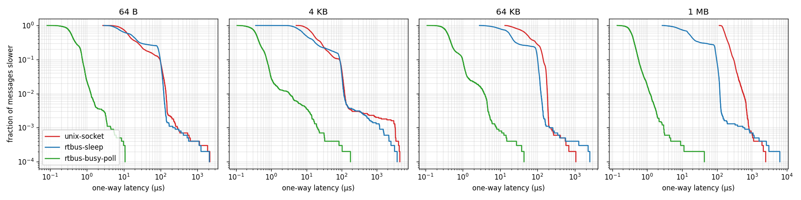
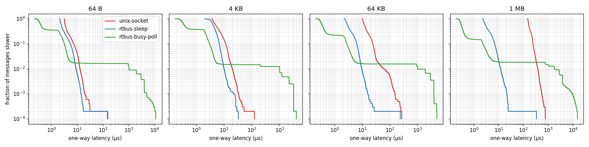

# Latency results (phase 2)

rtbus against a Unix domain stream socket, between two processes on one machine.

## What is measured

- **One-way latency.** The sender fills a message, stamps it with `CLOCK_MONOTONIC` and hands
  it to the transport. The receiver stamps it again once the whole message is available to it:
  - **rtbus:** when the subscriber's callback starts.
  - **Socket:** when the last byte has been read.

  Filling the message is not part of the latency.
- **Rate and sample count.** One message every millisecond, 10,000 measured messages per case,
  after 200 warm-up messages.
- **The three transports:**
  - `unix-socket`: a `SOCK_STREAM` socketpair. Each message is framed by its length. The
    receiver blocks in `read()`.
  - `rtbus-sleep`: the default subscriber, which sleeps on a futex between messages.
  - `rtbus-busy-poll`: a subscriber whose thread spins on its queue (`WaitMode::kBusyPoll`).
- **Percentiles.** Nearest-rank, meaning the smallest sample with at least that fraction of
  samples at or below it. Every run had 0 lost messages unless a table says otherwise.
- **rtbus does not touch the payload before its stamp.** Its receiver has a pointer into shared
  memory and has not read the payload yet. The socket's receiver has already copied every byte.
  That difference is the point of zero-copy, but reading a large payload still costs something
  (see the `memcpy` row below).

### Machine

Measured on 2026-09-28.

| | |
|---|---|
| CPU | Intel Core i7-11390H, 4 cores / 8 threads, 5 MiB L2, 12 MiB L3 |
| OS | Ubuntu 20.04, kernel 5.15.0-139-generic (not PREEMPT_RT) |
| Compiler | g++ 10.5, `-O3 -DNDEBUG` (the `release` preset) |
| Frequency governor | `powersave`, energy preference `balance_power` |
| Idle states | C1 (1 µs exit), C2 (253 µs), C3 (1048 µs), as reported by the kernel |
| Tuning | None: no `isolcpus`, no pinned IRQs, no real-time priority |
| Load | A desktop session with an IDE and a browser (load average about 3) |

This is a laptop, not a real-time machine. The tails reported here (p99.9 and max) include
interrupts, other processes and power management.

## Run A: the machine as it is

```bash
cmake --preset release && cmake --build --preset release
./build/release/bench/rtbus_latency 10000 latency.csv
python3 bench/plot_latency.py latency.csv latency.png
```

| transport | size | p50 µs | p99 µs | p99.9 µs | max µs |
|---|---:|---:|---:|---:|---:|
| unix-socket | 64 B | 13.9 | 139.8 | 253.7 | 2169.9 |
| rtbus-sleep | 64 B | 17.0 | 122.0 | 170.9 | 2104.1 |
| rtbus-busy-poll | 64 B | 0.4 | 1.3 | 3.5 | 10.9 |
| unix-socket | 4 KB | 16.4 | 121.4 | 3262.9 | 4500.5 |
| rtbus-sleep | 4 KB | 9.8 | 115.0 | 1192.7 | 3770.6 |
| rtbus-busy-poll | 4 KB | 0.4 | 3.2 | 19.3 | 178.0 |
| unix-socket | 64 KB | 56.2 | 184.7 | 201.9 | 1073.2 |
| rtbus-sleep | 64 KB | 19.2 | 124.5 | 170.6 | 2541.2 |
| rtbus-busy-poll | 64 KB | 0.4 | 3.7 | 7.5 | 43.9 |
| unix-socket | 1 MB | 175.4 | 562.9 | 794.8 | 2471.0 |
| rtbus-sleep | 1 MB | 17.5 | 120.8 | 386.9 | 6291.4 |
| rtbus-busy-poll | 1 MB | 0.4 | 1.2 | 3.0 | 43.4 |



## Run B: the same, with idle states kept out

The drop near 100 µs in both sleeping transports in run A (about a quarter of all messages) is
the cost of waking a CPU core from a deep idle state. Run B tests that explanation:

- The whole benchmark is pinned to cores 2 and 3.
- Each of those cores runs a spin loop at the lowest priority, `nice 19`.

The spinners keep the cores out of idle states. A thread that is woken still preempts them at
once, so the wake-up itself stays in the measurement.

```bash
nice -n 19 taskset -c 2 sh -c 'while :; do :; done' &
nice -n 19 taskset -c 3 sh -c 'while :; do :; done' &
taskset -c 2,3 ./build/release/bench/rtbus_latency 10000 latency.csv
kill %1 %2
```

| transport | size | p50 µs | p99 µs | p99.9 µs | max µs |
|---|---:|---:|---:|---:|---:|
| unix-socket | 64 B | 3.5 | 12.6 | 18.5 | 147.2 |
| rtbus-sleep | 64 B | 2.5 | 8.8 | 13.6 | 152.4 |
| unix-socket | 4 KB | 5.3 | 19.8 | 31.8 | 123.5 |
| rtbus-sleep | 4 KB | 4.2 | 10.0 | 20.9 | 32.7 |
| unix-socket | 64 KB | 12.4 | 59.2 | 150.6 | 269.6 |
| rtbus-sleep | 64 KB | 3.0 | 9.5 | 15.6 | 238.8 |
| unix-socket | 1 MB | 167.1 | 377.0 | 542.8 | 766.6 |
| rtbus-sleep | 1 MB | 3.1 | 11.9 | 21.1 | 336.2 |



**Busy-polling in run B.** The busy-poll rows are left out of the table because they measure
something else here. The subscriber had to share its core with a spinner, and its p99 rose to
about 1 ms, which is one scheduler time slice. At 1 MB it fell more than 16 messages behind and
lost 4 of them. Busy-polling pays off only with a core of its own.

## Microbenchmarks

These measure the CPU cost of the publish path in one thread, with no second process and no
wake-up. The numbers are the median of 5 repetitions.

```bash
./build/release/bench/rtbus_micro --benchmark_repetitions=5 --benchmark_report_aggregates_only=true
```

| benchmark | 64 B | 4 KB | 64 KB | 1 MB |
|---|---:|---:|---:|---:|
| loan, publish to 1 subscriber, take and finish | 72 ns | 75 ns | 75 ns | 72 ns |
| `memcpy` of the same size, for comparison | 2 ns | 47 ns | 1.7 µs | 57 µs |

| subscribers | 1 | 2 | 4 | 8 |
|---|---:|---:|---:|---:|
| one publish, then every subscriber takes and finishes it (64 B) | 72 ns | 123 ns | 214 ns | 407 ns |

`WakeSignal::notify()` with no sleeping subscriber costs 15 ns. That is the price a publish
pays, per subscriber, to learn that nobody needs waking. Most of it is the sequentially
consistent fence that prevents lost wake-ups.

## What the numbers say

1. **rtbus's cost does not depend on message size.** Publishing and taking a message costs
   about 72 ns whether it is 64 B or 1 MB. Latency tells the same story:
   - Run B, sleeping subscriber: rtbus p50 stays between 2.5 and 4.2 µs at every size.
   - The socket climbs from 3.5 µs to 167 µs, the price of copying 1 MB through the kernel
     twice.
2. **For small messages on an untuned machine, waking the receiver dominates.** Run A shows a
   sleeping rtbus subscriber no faster than a socket at 64 B (17.0 µs against 13.9 µs p50).
   Both wait for a CPU core to leave an idle state. Once idle states are out of the picture
   (run B), rtbus is ahead at every size, but at 64 B only by about 1 µs at p50.
3. **Busy-polling removes the wake-up entirely.** It holds 0.3 to 0.4 µs p50 at every size and
   every run, and 1.2 to 3.7 µs p99 in run A. The cost is a CPU core spinning at 100% for each
   such subscriber, and the tail collapses to milliseconds if that core is shared.
4. **The worst cases are milliseconds everywhere.** The max column and the p99.9 of some cases
   come from the machine: interrupts, other processes and power management. Bounding them
   needs real-time tuning, which is later work (isolated cores, `SCHED_FIFO`, PREEMPT_RT).
   Nothing here claims a real-time guarantee.

### Run-to-run variation

The sleeping cases move a lot between runs on this laptop, because the idle-state governor's
decisions depend on everything else the machine is doing. A shorter trial run (500 samples)
measured the socket at 96 µs p50 at 64 B and a sleeping rtbus at 24 µs, against 13.9 and
17.0 µs in run A. The busy-poll p50 was 0.4 µs in every run.
